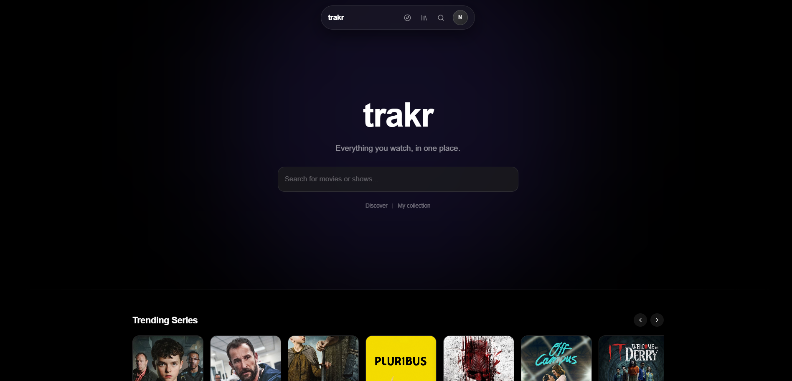
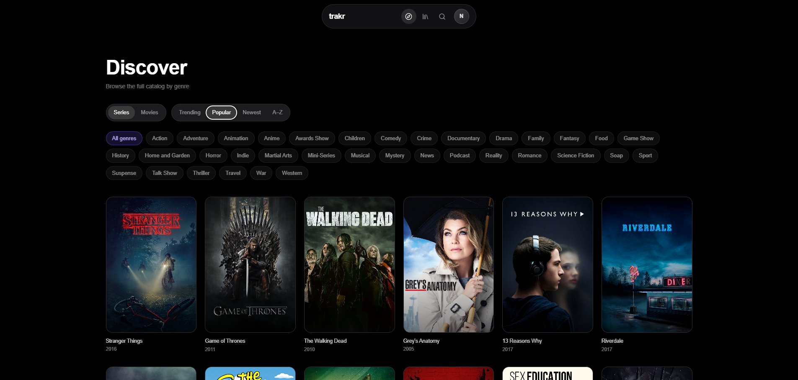
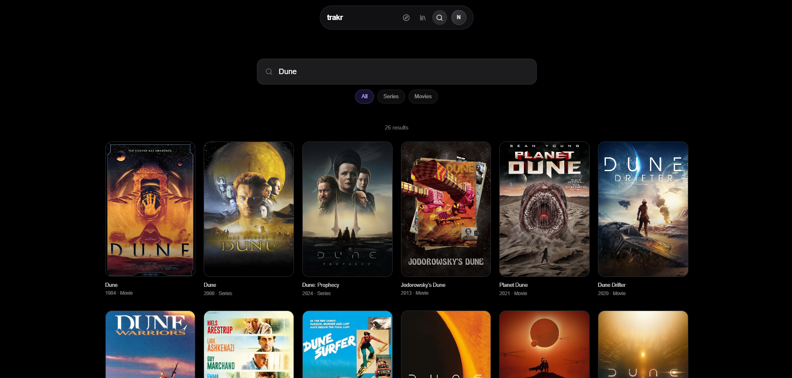
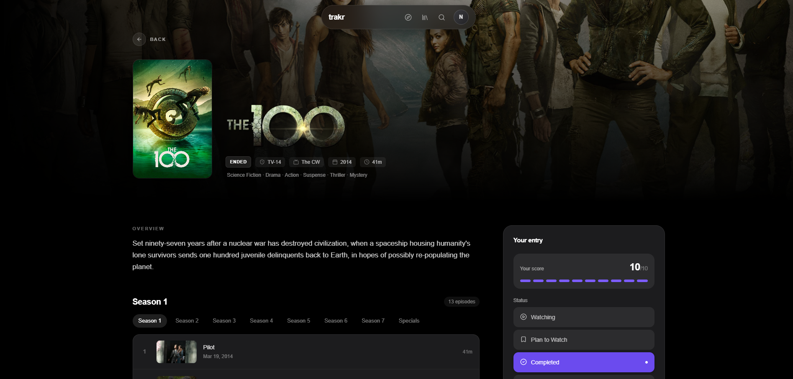
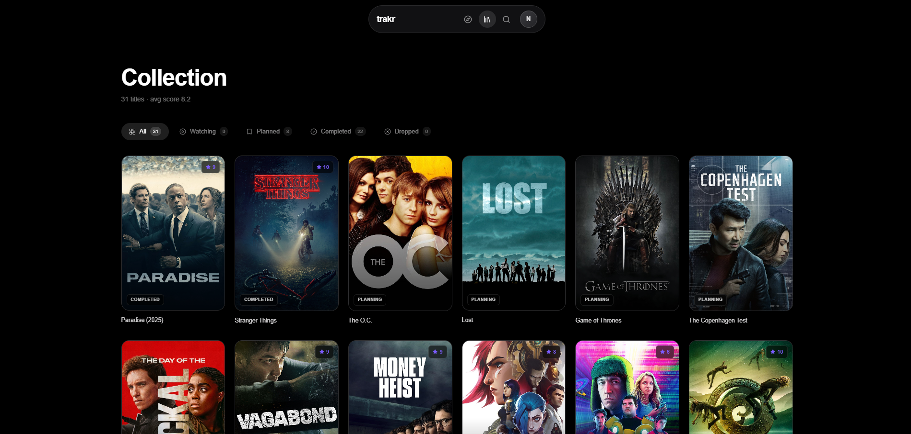

<p align="center">
  
</p>

<h1 align="center">trakr</h1>
<p align="center">
  Your movies and shows, tracked. A fast, cinematic way to discover what's next and keep score of everything you watch.
</p>

<p align="center">
  <a href="https://trakr.lol"><strong>▶ Try it at trakr.lol</strong></a>
</p>

<p align="center">
  <a href="#-features">Features</a> ·
  <a href="#-screenshots">Screenshots</a> ·
  <a href="#-run-it">Run it</a> ·
  <a href="#-license">License</a>
</p>

---

Every other tracker feels like a spreadsheet with a poster grid bolted on. trakr doesn't. It's built around a single cinematic hero that rotates through what's actually trending, a genre-driven Discover page for when you don't know what you want yet, and a Collection that stays out of your way until you need it. Movie and show data comes straight from [TheTVDB](https://thetvdb.com/).

> **trakr is live at [trakr.lol](https://trakr.lol)** — that's the real thing,
> and the fastest way to see it. This repository is the web client behind it,
> published so the build is readable; the API it talks to is a separate service
> that isn't public.

## ✨ Features

- **Discover** — a rotating hero of what's trending, rails of trending and popular series and movies, and a full catalog you can filter by genre and sort by Trending / Popular / Newest / A–Z.
- **Search** — results as you type, filterable to series or movies.
- **Details** — season-by-season episodes, cast, artwork, trailers and the rest of the metadata for every title.
- **Collection** — track anything as Watching, Plan to Watch, Completed or Dropped, score it out of 10, and pick up where you left off from the homepage.
- **Works signed out** — browsing needs no account; signing in is only for tracking.
- **Mobile-ready** — a glass navbar on desktop, a bottom tab bar on mobile, and grids that reflow to any screen.

## 📸 Screenshots

| Discover                                | Search                              |
| --------------------------------------- | ----------------------------------- |
|  |  |

| Details                               | Collection                                  |
| ------------------------------------- | ------------------------------------------- |
|  |  |

## 🚀 Run it

If you just want to use trakr, go to [trakr.lol](https://trakr.lol) — nothing to
install. What follows is for running the client from source.

**You'll need:** [Node](https://nodejs.org/) 20+ and a trakr API to point
`VITE_API_URL` at. The hosted one only accepts browser requests from the
trakr.lol origin, so a local build can't borrow it.

```bash
cp .env.example .env    # point VITE_API_URL at your API (default: http://localhost:3007)

npm install
npm run dev             # http://localhost:5173
```

### Docker

`VITE_API_URL` is compiled into the bundle, so it's a **build** argument, not a
runtime one — the build fails loudly if it's empty rather than shipping an image
that calls the wrong origin.

```bash
docker build --build-arg VITE_API_URL=https://api.example.com -t trakr-web .
docker run -p 5173:80 trakr-web
```

### Other scripts

```bash
npm run build     # production bundle → dist/
npm run preview   # serve the built bundle locally
npm run lint
```

## 🛠️ Tech stack

React 19, TypeScript, React Router, Tailwind CSS v4, Vite — built and served as a
static bundle behind Nginx, whose config rewrites client-side routes and exposes
`/health`.

Pushes to `main` build the image, publish it to GHCR and ping Dokploy to pull it,
which is how [trakr.lol](https://trakr.lol) updates — see
[deploy.yml](.github/workflows/deploy.yml). Because `VITE_API_URL` is baked in at
build time, the production API origin lives in repository secrets rather than in
this repo.

## 📄 License

[MIT](LICENSE) © Nexiq7
